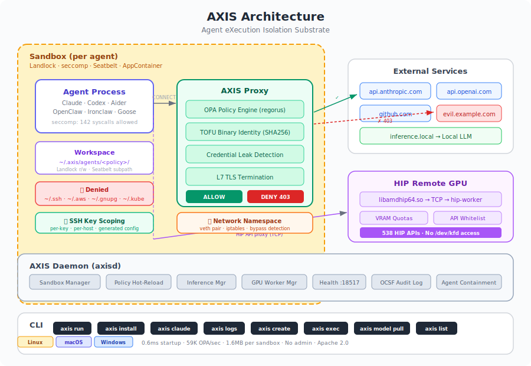

# AXIS: Agent eXecution Isolation Substrate

A high-performance OS-native agent sandbox runtime — secure, policy-governed execution for autonomous AI agents on your local hardware. No containers, no VMs, no admin privileges.

<p align="center">
  
</p>

## What It Does

AXIS isolates AI agent processes using OS-native primitives:

| Layer | Linux | Windows | macOS |
|---|---|---|---|
| Process | seccomp-BPF (142-syscall whitelist) | Restricted Token + Job Object | Seatbelt (sandbox-exec) |
| Filesystem | Landlock LSM | NTFS ACLs + Low Integrity | Seatbelt profile (subpath rules) |
| Network | netns + veth + iptables + HTTP proxy | AppContainer + loopback proxy | Seatbelt network deny + proxy |
| GPU | HIP Remote (para-virtual GPU via TCP) | HIP Remote (TCP) | HIP Remote (TCP to Linux host) |
| Inference | Local LLM via llama.cpp or vLLM | Same | Same |

Every network request goes through a policy-evaluated proxy. The agent never touches the real GPU driver — HIP API calls are proxied to a worker process.

## Install

```bash
# Linux / macOS
curl -sSf https://raw.githubusercontent.com/axis-sandbox/axis/main/install.sh | sh
```

```powershell
# Windows (PowerShell)
irm https://raw.githubusercontent.com/axis-sandbox/axis/main/install.ps1 | iex
```

```bash
# Nightly builds
curl -sSf .../install.sh | sh -s -- --nightly    # Linux/macOS

# Build from source
cargo install --path crates/axis-cli
cargo install --path crates/axis-daemon

# Linux packages
sudo dpkg -i axis_0.1.0_amd64.deb    # Debian/Ubuntu
sudo rpm -i axis-0.1.0-1.x86_64.rpm  # Fedora/RHEL
```

## Quick Start

```bash
# Run anything in a sandbox — one command, zero config
axis run -- python -c "print('Hello from AXIS sandbox')"
```

That's it. The process runs with Landlock filesystem isolation, seccomp syscall filtering, and network policy enforcement — all in 0.6ms startup with no admin privileges.

```bash
# Run an agent with a policy
axis run --policy coding-agent.yaml -- python my_agent.py

# Or use the daemon for multi-sandbox management
axsd &
axis create --policy policies/coding-agent.yaml -- python my_agent.py
axis list
axis destroy <sandbox-id>
```

## Platform Details

### macOS (Seatbelt)

On macOS, AXIS uses Apple's [Seatbelt](https://developer.apple.com/documentation/security) sandbox profiles via `sandbox-exec`. A `.sb` profile is generated dynamically from the AXIS policy YAML:

- **Default deny** — `(deny default)` blocks all operations not explicitly allowed
- **Filesystem** — read-only system paths (`/usr`, `/System`, `/Library`), read-write workspace only
- **Network** — proxy mode allows only `localhost:*` (to reach the AXIS proxy), denies all other connections
- **Security** — blocks writes to system paths, `process-info*` on other processes, `system-privilege`

No admin or root required. Works on macOS 12+ (Monterey and later).

### Linux (Landlock + seccomp + netns)

Linux uses three independent kernel isolation layers applied in the child's `pre_exec`:
1. `setns(CLONE_NEWNET)` — enters a network namespace with veth pair routing through the proxy
2. Landlock ABI V2+ — filesystem allowlist enforced by the kernel
3. seccomp default-deny — 142 of ~400 syscalls whitelisted; everything else returns EPERM

### Windows (AppContainer + Job Object)

Windows uses Win32 APIs available on Windows 11 Home (no Pro/Enterprise required):
- **Restricted Token** with Low Integrity Level — strips all privileges
- **Job Object** — process count, memory, CPU rate limits with `KILL_ON_JOB_CLOSE`
- **AppContainer** with zero capabilities — kernel-level network deny
- **ETW bypass detection** — monitors for non-proxy network connections

## GPU Sandbox

Agents can use AMD GPUs without direct hardware access:

```bash
# Download a model
axis model pull TheBloke/TinyLlama-1.1B-Chat-v1.0-GGUF/tinyllama-1.1b-chat-v1.0.Q4_K_M.gguf

# Run with GPU policy (requires hip-worker on GPU host)
axis run --policy policies/gpu-agent.yaml -- python gpu_agent.py
```

The sandbox sees the GPU via `libamdhip64.so` (538 HIP symbols) proxied over TCP to a `hip-worker` on the GPU host. Tested with AMD RX 9070 XT — full `hipMalloc`/`hipMemcpy`/`hipDeviceSynchronize` verified from a VM with zero GPU drivers.

## Policy

Policies are declarative YAML:

```yaml
version: 1
name: my-agent

filesystem:
  read_only: [/usr, /lib, /etc/ssl/certs]
  read_write: ["{workspace}"]
  deny: ["~/.ssh", "~/.gnupg"]

process:
  max_processes: 32
  max_memory_mb: 8192
  cpu_rate_percent: 80

network:
  mode: proxy
  policies:
    - name: github
      endpoints:
        - host: api.github.com
          port: 443

gpu:
  enabled: true
  device: 0
  vram_limit_mb: 8192

inference:
  default_provider: local-rocm
  routes:
    - name: local
      endpoint: http://localhost:8080
      model: llama-4-scout-109b
```

Validate: `axis policy validate my-policy.yaml`

## Architecture

```
axis/
├── crates/
│   ├── axis-core/       # Policy parser, OPA engine (regorus), OCSF audit
│   ├── axis-safety/     # Credential leak detection (11 patterns)
│   ├── axis-sandbox/    # Landlock, seccomp, netns (Linux) / Job Object, AppContainer (Windows)
│   ├── axis-proxy/      # HTTP CONNECT proxy, OPA eval, L7 TLS termination, inference.local
│   ├── axis-router/     # Inference routing, model registry, smart routing, token budgets
│   ├── axis-gpu/        # HIP Remote protocol, API filter, VRAM quotas, worker lifecycle
│   ├── axis-daemon/     # Sandbox manager, IPC, policy hot-reload
│   └── axis-cli/        # CLI: run, create, exec, destroy, list, policy, model
├── hip-remote/          # HIP Remote client (libamdhip64.so) + worker (hip-worker)
├── policies/            # Built-in policy templates
├── benches/             # Performance benchmarks
└── e2e/                 # End-to-end tests
```

## Performance

| Metric | Linux | Windows | Target |
|---|---|---|---|
| Sandbox startup | 0.6ms | 1.6ms | <200ms / <500ms |
| OPA eval throughput | 59K/sec | 42K/sec | >10K/sec |
| OPA per-request | 17µs | 24µs | <5ms |
| Memory per sandbox | 1.6MB | — | <50MB |

## Status

Phase 0 (isolation) + Phase 1 (GPU) + Phase 2 (inference) complete. 86 unit/integration tests, 121 cross-platform e2e tests, all passing.

## License

Apache 2.0
